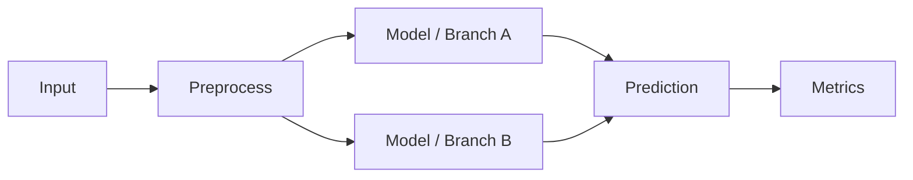

# Scenario XX: タイトル

## 0. このシナリオで一番言いたいこと

- **何をするか**: 
- **何を示したいか**: 
- **主比較**: 
- **入力**: 
- **出力**: 
- **主評価**: 
- **成功条件**: 
- **このシナリオの位置づけ**: 既存のどのシナリオの次か / 何を補強するか

---

## 1. 位置づけ

- 前提となる既存シナリオ:
- このシナリオで新しく変えるもの:
- このシナリオで変えないもの:
- このシナリオが終わると何が言えるようになるか:

---

## 2. 研究目的

### 主目的
1. 
2. 

### 副目的
1. 
2. 

---

## 3. 研究質問（RQ）

- **RQ1:** 
- **RQ2:** 
- **RQ3:** 

---

## 4. 仮説

- **H1:** 
- **H2:** 
- **H3:** 

> 反証条件:
> - H1 が否定されるのはどういう結果か
> - H2 が否定されるのはどういう結果か

---

## 5. 30秒でわかる実験設定

| 項目 | 内容 |
|---|---|
| サンプル単位 | |
| 入力 | |
| 出力 | |
| 比較対象 | |
| 固定条件 | |
| 可変条件 | |
| 主評価 | |
| 補助評価 | |
| 成功条件 | |

---

## 6. 問題設定

### 6.1 1サンプルの定義
- 
- 

### 6.2 入力
- 使う特徴量:
- 形状:
- 時系列窓:
- 未来既知 / 当日観測 / static の区別:

### 6.3 出力
- 予測対象:
- horizon:
- タスク種別: one-step / multi-step / reconstruction / classification

### 6.4 このシナリオでの「何を当てるか」
- 

---

## 7. 比較対象

## 7.1 主比較
- Condition A:
- Condition B:

## 7.2 比較するモデル / 実験条件
### Exp-0: baseline
- 目的:
- 入力:
- 出力:
- 備考:

### Exp-1: main
- 目的:
- 入力:
- 出力:
- 備考:

### Exp-2: control / ablation
- 目的:
- 入力:
- 出力:
- 備考:

> **主比較はどれかを明記すること**
> - 例: この文書で一番重要なのは Exp-1 vs Exp-2

---

## 8. 固定条件と可変条件

## 8.1 固定条件
- train / valid / test split
- normalization
- 欠損処理
- window size
- optimizer / lr / batch size / epochs
- seed
- 評価対象データ

## 8.2 可変条件
- 
- 

## 8.3 公平比較の前提
- モデル以外は同一条件にする
- 未来未知変数は使わない
- leakage を防ぐ
- 指標算出条件を統一する

---

## 9. データ設計

### 9.1 粒度
- 日次 / 週次 / 行単位 など

### 9.2 キー
- 例: store_id × product_id

### 9.3 使用カラム
#### static
- 

#### known-future
- 

#### observed-only
- 

### 9.4 前処理
- 数値化
- 正規化
- 欠損処理
- カテゴリ符号化

### 9.5 リーク防止
- 
- 

---

## 10. モデル設計

### 10.1 モデル構成
- 
- 

### 10.2 条件ごとの差分
- baseline:
- main:
- ablation:

### 10.3 モデル図


---

## 11. 評価設計

## 11.1 主評価

* WAPE
* MAE
* RMSE
* Macro-F1 など

## 11.2 補助評価

* subset 評価
* horizon 別評価
* ablation
* probe
* calibration / coverage

## 11.3 subset

* all
* stockout
* non-stockout
* holiday
* promo
* high-volatility

## 11.4 統計的頑健性

* seeds:
* mean ± std:
* 必要なら検定:
* 効果量:

---

## 12. 成功条件

### 最低条件

*

### 望ましい条件

*

### 強い条件

*

---

## 13. 失敗した場合に何が分かるか

* もし A が B に勝てなければ:
* もし subset でしか改善しなければ:
* もし seed で不安定なら:
* 次に疑うべき箇所:

> negative result でも意味がある形で書く

---

## 14. 想定される解釈

### 良い場合

*

### 悪い場合

*

### 解釈上の注意

* ここでは何までは言えるか
* 何はまだ言えないか

---

## 15. 実装仕様

### 15.1 実行コマンド

```bash
uv run python scenarios/scenarioXX/run.py \
  --seed 42 \
  ...
```

### 15.2 主要引数

* `--seed`
* `--window`
* `--horizon`
* `--ablation-mode`

### 15.3 出力物

* `metrics_overall.csv`
* `metrics_by_subset.csv`
* `predictions.parquet`
* `summary.md`

---

## 16. 実行手順

1.
2.
3.
4.

---

## 17. チェックリスト

* [ ] 1サンプル定義が明記されている
* [ ] 入力 / 出力が1行で言える
* [ ] 主比較が1つに絞られている
* [ ] 固定条件 / 可変条件が分かれている
* [ ] leakage 防止が書かれている
* [ ] 主評価と成功条件がある
* [ ] negative result の意味が書かれている
* [ ] 出力ファイルが定義されている

---

## 18. 一文まとめ

**このシナリオは、XXX を固定した上で YYY を比較し、ZZZ が有効かを AAA 指標で検証する実験である。**

