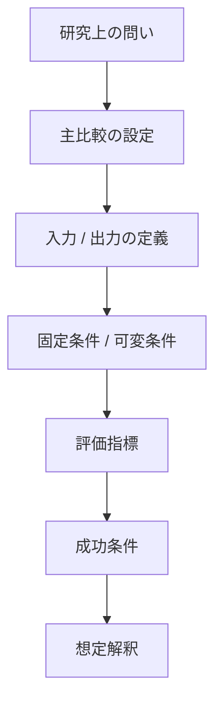
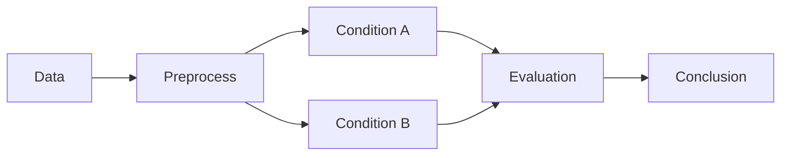

## おすすめの設計方針

各シナリオ文書を、次の3層で固定するとかなり読みやすくなります。

1. **30秒でわかる要約**

   * 何を比べるのか
   * 何を示したいのか
   * 何が成功条件か

2. **研究として必要な条件**

   * 入出力
   * 比較条件
   * 固定条件
   * 評価設計
   * リーク防止
   * 反証可能性

3. **実装・運用**

   * CLI
   * 出力ファイル
   * 実行順
   * ログ確認ポイント

今の文書は 2 と 3 は強いので、**1 を先頭に足す**のが一番効きます。

---

## まず足すべき「冒頭サマリー」

各シナリオの冒頭に、これを必ず置くのがおすすめです。

```md
## 0. このシナリオで一番言いたいこと

- **何をするか**: XXX と YYY を同一条件で比較する
- **何を示したいか**: ZZZ が有効 / 無効であることを確かめる
- **主比較**: A vs B
- **入力**: 過去 W ステップの ...
- **出力**: H ステップ先の ...
- **主評価**: test WAPE
- **成功条件**: A が B より平均 1%以上改善
- **読む順番**: ここ → 比較条件 → 評価設計 → 成功条件
```

これがあるだけで、かなり「ぱっと分かる」ようになります。

---
- [テンプレート](./000-Template.md)
---

## 「ぱっと分かる」ために特に重要な項目

全部大事ですが、初見理解に効くのは次の7つです。

- **0. このシナリオで一番言いたいこと**
- **5. 30秒でわかる実験設定**
- **7. 主比較は何か**
- **8. 固定条件と可変条件**
- **11. 主評価**
- **12. 成功条件**
- **13. 失敗した場合に何が分かるか**

この7つがあると、「結局何を比較するの？」が消えます。

---

## あなたの現在の文書に対する具体的な改善点

今の文書はとても丁寧ですが、次を入れると一気に読みやすくなります。

### 1. 各シナリオの先頭に「主比較」を1行で書く
例:
- `主比較: Scenario2 vs Scenario4`
- `主比較: Exp-16B vs Exp-16C`
- `主比較: Prophet(P1) vs V2`

### 2. 「固定条件」と「今回いじる条件」を明示的に分ける
これは Scenario17 や Scenario8 ではかなりできています。ここを全シナリオで統一すると、読者が安心します。

### 3. 成功条件だけでなく「失敗時の意味」を毎回書く
研究ではここがかなり重要です。  
「勝てなかった = 無意味」ではなく、「どの仮説が否定されたか」に落とすと強いです。

### 4. 実装仕様は後ろに寄せる
CLI や出力ファイルは大事ですが、初見の人はまず
- 何をしたいのか
- なぜその比較か
- 何をもって成功とするか  
を知りたいです。

### 5. 結果記録パートは別見出しに分離する
Scenario18 のように、計画と実行ステータスが1文書に同居すると便利ですが、最初に読む人にはやや重いです。  
なので
- `計画`
- `実行状況`
- `結果`
- `考察`
を大見出しで明確に切るのがよいです。

---

## Mermaid で入れると見やすい図

各シナリオ共通で、これを入れるとかなり伝わります。





さらに、実験条件の構造図も有効です。




---

## かなり大事な運用ルール

テンプレートだけでなく、運用として次を固定すると文書品質が安定します。

- **各シナリオで主比較は1つに絞る**
- **成功条件は定量で書く**
- **固定条件と可変条件を分ける**
- **negative result の意味を書く**
- **共通定義は 00 に寄せ、各シナリオでは差分だけ書く**

これは、あなたの `00-experiment_problem_setting.md` の思想ともかなり相性が良いです。

---

必要なら次に、**あなたの Scenario18 をこのテンプレートに合わせて実際にリライトした版**をそのまま Markdown で作れます。
```
