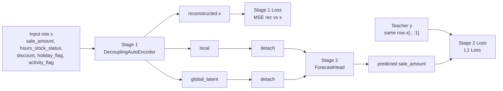

# Scenario 4: Two-stage Pipeline (Recovery → Forecast)



## このシナリオの問い
**「需要復元を先に行う二段構成は、研究設計として成立するか？」** を確認する実験です。

> 共通定義（1サンプル・global/local・指標）は `doc/00-experiment_problem_setting.md` を先に参照してください。

## 1サンプルの具体化（Scenario 4）
- Stage 1 入力 `x_i`: `sale_amount, hours_stock_status, discount, holiday_flag, activity_flag`
- Stage 1 目的: `x_i` の再構成（recovery proxy）
- Stage 2 入力: Stage 1 で得た `local_i`, `global_i`
- Stage 2 目的: `sale_amount` 近傍指標（実装では `x[:, :1]`）を予測

## モデル
- Stage 1: `DecouplingAutoEncoder`（MSE）
- Stage 2: `ForecastHead`（L1）
- 評価: Stage1_recovery_mse, Stage2_wape

## このシナリオで言えること / 言えないこと
### 言えること
- recovery と forecast をコード構造として分離できる。
- Stage 1/2 を独立改善できる実験土台になる。

### 言えないこと
- 現時点では Scenario 2 より優れることは保証しない（比較実験が必要）。
- Stage 1 が真の潜在需要を復元した、と断定はできない。

## Scenario 2 との違い
- Scenario 2 は **raw sales を直接予測**（単段・ベースライン）。
- Scenario 4 は **recovery を経由**（二段・仮説検証向き）。
- 研究上は、S4 が S2 より改善する条件（例: stockout多発期間）を示せて初めて価値が立つ。

## 実行
```bash
uv run python scenarios/scenario4_two_stage_pipeline/run.py
```
