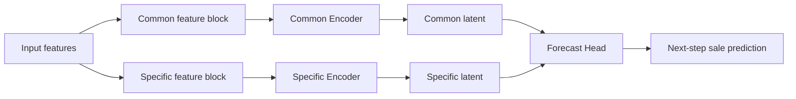

# Scenario 9: Common / Specific 一次割り当て実験計画（第一版）

## 位置づけ
本シナリオは、Decoupling 系の考え方における

- **global = time-independent characteristics**
- **local = time-varying / non-stationary factors**

を、FreshRetailNet-50K の小売文脈に読み替えて検証する実験です。

- **common（global）**: 階層属性・共有文脈・長期的背景
- **specific（local）**: 直近状態・短期施策・時変動

Scenario2（両 branch 同一入力）を基準に、
**特徴量を役割に応じて分けて入力したときに、予測性能と表現の役割差が両立するか**を確認します。

---

## 1. 実験目的

### 主目的
FreshRetailNet-50K において、common / specific の入力分離で

1. 予測性能を維持できるか
2. latent の役割差（構造寄り vs 状態寄り）を確認できるか

を検証する。

### 副目的
- 「両 branch に同じ特徴量を入れる」設計との差を定量化する。
- 後続の stock 拡張（Scenario10）に向けた基礎線を作る。

---

## 2. 定義（operational）

### 2.1 common（global）
時間に対して比較的安定で、系列の位置づけや長期水準を規定しやすい要因。

- 階層構造
- 共有されるカレンダー文脈
- 比較的緩やかな外生環境

### 2.2 specific（local）
時点依存の状態や直近観測から生じる短期変動を表す要因。

- 直近売上推移
- 時間別売上推移
- 短期施策やイベント

---

## 3. 一次割り当て特徴量

## 3.1 common encoder 入力

### 階層・構造（categorical）
- `city_id`
- `store_id`
- `management_group_id`
- `first_category_id`
- `second_category_id`
- `third_category_id`
- `product_id`

### 共有文脈（calendar）
- `dt` 由来: 曜日 / 月 / 日 / （必要に応じて週番号）
- `holiday_flag`

### 外生環境（dense）
- `precpt`
- `avg_temperature`
- `avg_humidity`
- `avg_wind_level`

## 3.2 specific encoder 入力

### 直近系列（sequential）
- `sale_amount` の過去 window
- `hours_sale` の過去 window

### 短期施策（dense/contextual）
- `discount`
- `activity_flag`

## 3.3 本シナリオでは主実験から外す特徴
- `stock_hour6_22_cnt`
- `hours_stock_status`

> stock 系は Scenario10 で拡張検証する。

---

## 4. モデル設計

## 4.1 基本構成
- common encoder と specific encoder を分離
- branch ごとに別特徴群を入力
- latent を統合して予測 head に入力
- target は `sale_amount` one-step forecast

## 4.2 構造図

---

## 5. 研究質問（RQ）

- **RQ1:** 特徴量の分離入力で、予測上の役割差は観測できるか。
- **RQ2:** common latent は構造・長期文脈寄り、specific latent は短期状態寄りの情報を保持するか。
- **RQ3:** 両 branch 同一入力より、役割分離入力の方が解釈性を改善するか。

---

## 6. 仮説

- **H1:** 分離入力にしても Exp-0 比で予測性能は大きく崩れない。
- **H2:** common latent は階層・カテゴリ・カレンダー情報の保持が強い。
- **H3:** specific latent は直近変動・短期状態の保持が強い。
- **H4:** 同一入力より分離入力の方が branch の役割差が明瞭になる。

---

## 7. 実験系列（Scenario9 内）

## Exp-0: 基準（Scenario2 相当）
- 両 branch に同一特徴量を入力。

## Exp-1: 一次割り当て（主実験）
- common: hierarchy + calendar + holiday + weather
- specific: lag sales + hours sale + discount + activity

## Exp-2: 入れ替え対照
- common: lag sales + hours sale + discount + activity
- specific: hierarchy + calendar + holiday + weather

### Exp-2 の狙い
割り当てに意味があるなら、Exp-1 と Exp-2 に系統差が出る。

---

## 8. 入力テンソル設計（実装前に固定）

## 8.1 時系列軸
- `batch = B`
- `lookback window = W`
- one-step target（`t+1`）

## 8.2 common 側
- categorical embeddings: `B x E_cat_total`（または `B x W x E_cat_total`）
- dense context: `B x D_common`（または `B x W x D_common`）

> 実装方式（static として持つか、時点展開するか）を事前固定する。

## 8.3 specific 側
- sequential input: `B x W x D_seq`（`sale_amount`, `hours_sale`）
- contextual input: `B x W x D_ctx`（`discount`, `activity_flag`）

## 8.4 最終統合
- `z_common`: `B x Hc`
- `z_specific`: `B x Hs`
- concat 後 `B x (Hc+Hs)` を forecast head へ入力

---

## 9. データ処理ルール（固定）

- split（train/valid/test）は既存シナリオと同一。
- 正規化手順は Exp 間で統一。
- 欠損値処理・カテゴリ未知値処理を固定。
- `dt` 由来特徴の生成ロジックは 1 箇所で管理。

### `dt` 由来の推奨候補
- day-of-week（sin/cos or embedding）
- month（embedding）
- day-of-month
- week-of-year（任意）
- is_weekend

---

## 10. 評価設定

## 10.1 主評価
- WAPE
- WPE
- MAE

## 10.2 比較対象
- Exp-0 / Exp-1 / Exp-2
- 必要に応じて common-only / specific-only / both

## 10.3 集計粒度
- overall（全 test）
- 必要に応じて階層別（city / store / category）

---

## 11. 補助評価（役割差の確認）

## 11.1 latent ablation
- both
- common-only
- specific-only

> どの latent が何に寄与しているかを確認。

## 11.2 probe task

### common latent probe
- city/store/category/product の識別
- 長期平均売上帯の分類
- 曜日/祝日パターンの識別

### specific latent probe
- 次時点の増減方向
- 直近変動の大きさ
- `discount` / `activity_flag` の有無
- 短期残差の予測

---

## 12. 成功条件

### 最低条件
- Exp-1 が Exp-0 比で主指標を大きく悪化させない。

### 望ましい条件
- Exp-1 の both が最良または同等最良。
- common-only / specific-only で役割差が観測される。
- probe で common=構造寄り、specific=状態寄りの差が見える。

### 強い条件
- Exp-1 が Exp-2 より自然な役割分担を示す。

---

## 13. 実行手順

1. Exp-0（再現）
2. Exp-1（主実験）
3. Exp-0 vs Exp-1 比較
4. ablation（common-only / specific-only / both）
5. Exp-2（必要時）
6. probe task
7. Scenario10（stock 拡張）へ移行

---

## 14. 想定解釈

### うまくいった場合
- 分離定義は妥当。
- 「branch を分ける」だけでなく「何を見せるか」が効く。

### うまくいかなかった場合
- 特徴量割り当てか定義が不十分。
- encoder 側制約（直交化・対比損失等）の追加を検討。

---

## 15. リスクと対策

- **リークリスク:** future 情報混入を unit test で監視。
- **次元不均衡:** branch 間 hidden 次元の感度を sweep。
- **カテゴリ過学習:** embedding dropout / weight decay を検討。
- **評価の偶然性:** seed 固定 + 複数 seed 平均で判定。

---

## 16. 期待アウトプット

- 実験結果表（Exp-0/1/2 + ablation）
- probe 結果表
- 解釈メモ（言えること / 言えないこと）
- Scenario10 の設計入力（stock 追加時の差分設計）

---

## 一文まとめ
**Scenario9 は、階層・カレンダー・天候を common、直近売上・時間別売上・施策を specific に一次割り当てし、役割分離入力で予測性能と latent の役割差が両立するかを検証する主実験である。**
