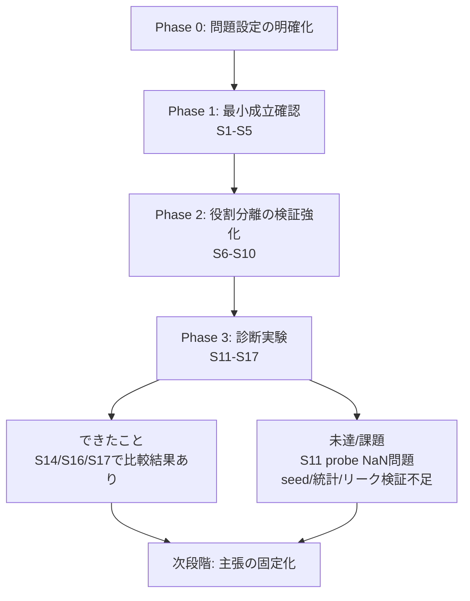
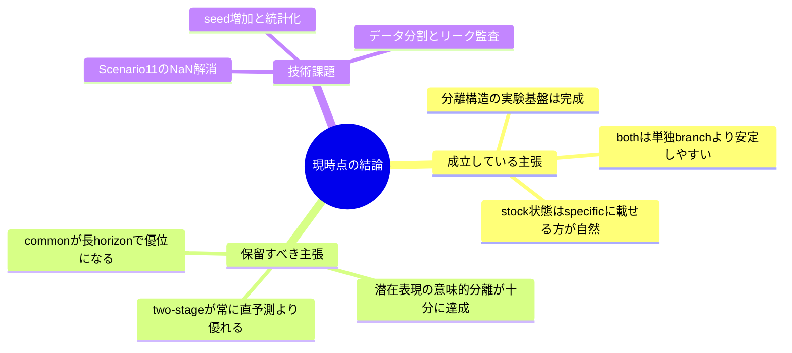

# 進捗報告（教授向け）

最終更新: 2026-04-13

## 1. 研究の主方向（何を明らかにしたいか）

本研究は、需要予測において入力情報を **common（比較的ゆっくり変わる要因）** と **specific/local（時点依存で速く変わる要因）** に分ける設計が有効かを、

1. 予測精度（WAPE/WPE/MAE）
2. 反実仮想・アブレーション
3. 潜在表現の probe

の3層で検証する流れです。土台となる問題設定は「行単位の表形式学習 + horizonシフト」で整理済みです。  
（厳密な sequence-to-sequence ではないことを明記済み。）

---

## 2. 現在の全体像（構造）

---

## 3. 進捗の積み上げ（シナリオ別）

## 3.1 基盤（S0〜S5）

- **S0（問題設定）**
  - 1サンプル定義、global/localの意味、評価指標、S2とS4の問いの違いを明文化。  
- **S1（表現学習の成立確認）**
  - 2分岐AEが学習ループとして成立する最小確認を完了。  
- **S2（raw forecast）/ S4（two-stage）**
  - 「直予測 vs recovery経由」の比較可能な土台を整備。  
- **S5（counterfactual sanity）**
  - latent swap による出力感度を確認する評価導線を用意。

> ここまでで「動く実験骨格」は確保済み。

## 3.2 分離仮説の強化（S6〜S10）

- S6で local/global/both の比較思想を明確化。
- S9/S10で common/specific への特徴割当実験を設計・実装ラインに接続。
- 特に stock系特徴の配置（specificに置くべきか）を、後段S16で直接検証する流れを構築。

## 3.3 診断フェーズ（S11〜S17）

- **S14（role clarification）**
  - seed平均で `both` が最良、`common_only`/`specific_only` が僅差で劣後。  
  - `both: wape_mean=0.424861`、`common_only: 0.426759`、`specific_only: 0.428800`。  
  - 結論: 「両branch併用が最も安定」という最小主張は支持。

- **S16（stock配置検証）**
  - `Exp16B (stockをspecificへ2特徴追加)` と `Exp16C (stockをcommonへ2特徴追加)` を比較可能な形で実行。  
  - `both`のtest WAPE（seed例）では、Exp16Cに悪化ケース（seed52で`0.456088`）が見られる一方、Exp16Bは相対的に安定。  
  - probeでも、Exp16Bで `z_specific` が `z_common` を一貫して上回る（例 seed52: 0.640334 vs 0.561519）。  
  - 結論: 「stock状態はspecific側に載りやすい」ことを支持。

- **S17（horizon依存）**
  - seed42では、h=1/3/7すべてで `common_only` が大きく劣後、`specific_only` は `both` に近い。  
  - 例: h=1 test WAPE `specific_only=0.428076`, `both=0.435065`, `common_only=0.666997`。  
  - 結論: 現時点では「短中期でspecific優位」は見えるが、「horizonを伸ばすとcommon寄与増」の主仮説は未確認（少なくともseed42では不成立）。

- **S11（latent probe）**
  - 訓練ログに `loss=nan` が多発し、probeの信頼性が未確立。  
  - ここは現状の大きな未解決課題。

---

## 4. 何ができて、何ができていないか

## 4.1 できていること（主張可能）

- 研究ストーリー（問題設定→比較→診断）をシナリオとして整理できた。
- branch比較（common_only/specific_only/both）を複数シナリオで再現できる。
- stock特徴の配置は、**commonよりspecificの方が妥当**という実験的根拠が出始めている。
- both優位（S14）とspecific優位（S17の短中期）は整合的。

## 4.2 まだできていないこと（主張保留）

- **S11のNaN問題**が未解消で、潜在表現の「意味づけ」証明が弱い。
- seed数・統計検定・信頼区間など、論文主張に必要な頑健性が不足。
- time leakage検証、split厳密性、前処理一貫性監査がドキュメント上は要補強。
- S4（two-stage）がS2をどの条件で上回るか、条件付き優位が未確定。
- S15はログ上、`steps=1` 実行結果が中心で、結論利用には再実行が必要。

---

## 5. 教授報告向けの「現時点での結論」

---

## 6. 今後4週間の実行計画（短期）

## Week 1: 信頼性回復
- S11 NaNの原因切り分け（正規化、学習率、欠損処理、カテゴリ埋め込み）
- 再現可能設定（固定seed、固定ログ、失敗時dump）を整備

## Week 2: 再実験（最小必須）
- S14/S16/S17 を3〜5 seedで再実行
- 主要指標を平均±標準偏差で再集計

## Week 3: 反証可能性の強化
- branch潰しアブレーションを統一プロトコル化
- subset（stockout/non-stockout）比較を全主要実験に横展開

## Week 4: 報告パッケージ化
- 「言える/言えない」を1枚表に固定
- 図表（棒グラフ、寄与落差、probe）を教授説明用に統合

---

## 7. いま教授に伝えるべき要点（要約）

1. 実験設計の段階は「探索」から「主張の絞り込み」に移行済み。  
2. 主要な前向き結果は、**bothの安定性**と**stock特徴のspecific配置妥当性**。  
3. ただし、**S11 NaN問題**と**統計的頑健性不足**により、意味分離の強い主張は時期尚早。  
4. 次の最優先は「信頼性の再確立（NaN解消 + seed再実行 + leak監査）」。

